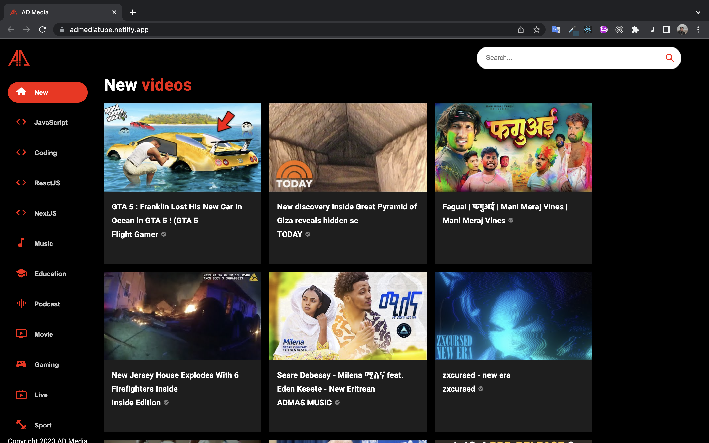

# This repo is React exercise

React exercise with react-router & material ui & rapidApi

## Installation and Setup Instructions

Example: Clone down this repository. You will need node and npm installed globally on your machine.

Installation:

    npm install

This exercise include [rapidapi](https://rapidapi.com/). Get api key for youtbe v3 and write to .env file.

To Start Server:

    npm start

## Demo

[Click me!!!!!!!!](https://admediatube.netlify.app/)

## Screenshot

